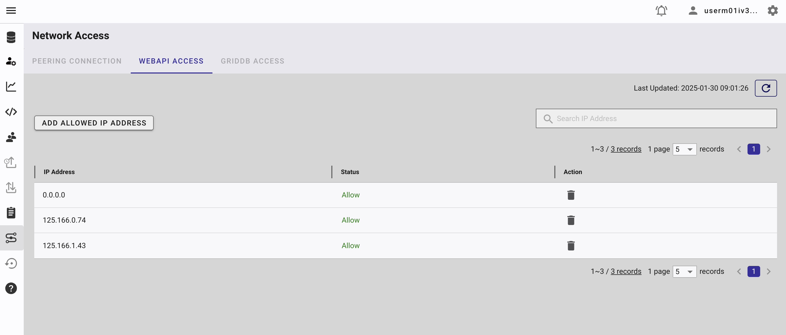
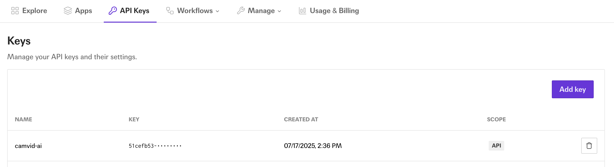
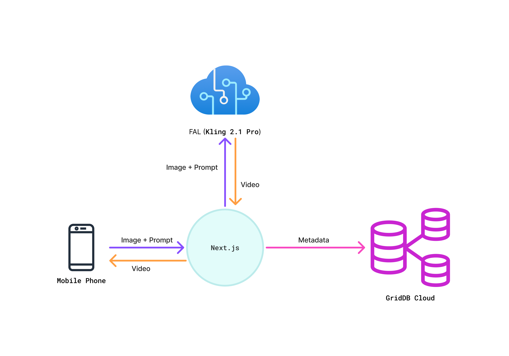

# Generate Fun Video From Camera Shoot using Kling AI


## What This Blog is About

Capturing a beautiful moment or any object in the  real life that you like from a camera and using AI to transform it into fun, stylized clips is a great way to engage users and showcase creative technology. In this guide, we build a developer-friendly pipeline using Next.js for the frontend, Fal.ai as a serverless inference runtime, Kling AI for video generation, and GridDB Cloud for real-time metadata storage. We’ll walk through how to capture frames from the webcam, send them to Kling for enhancement, log metadata (image URL, applied effects which is a prompt, ant generated video URL.) to GridDB, and render the final video.


## Prerequisites

### Node.js

This project is built using Next.js, which requires Node.js version 16 or higher. You can download and install Node.js from [https://nodejs.org/en](https://nodejs.org/en).

### GridDB

#### Sign Up for GridDB Cloud Free Plan

If you would like to sign up for a GridDB Cloud Free instance, you can do so at the following link: [https://form.ict-toshiba.jp/download_form_griddb_cloud_freeplan_e](https://form.ict-toshiba.jp/download_form_griddb_cloud_freeplan_e).

After successfully signing up, you will receive a free instance along with the necessary details to access the GridDB Cloud Management GUI, including the **GridDB Cloud Portal URL**, **Contract ID**, **Login**, and **Password**.

#### GridDB WebAPI URL

Go to the GridDB Cloud Portal and copy the WebAPI URL from the **Clusters** section. It should look like this:


#### GridDB Username and Password

Go to the **GridDB Users** section of the GridDB Cloud portal and create or copy the username for `GRIDDB_USERNAME`. The password is set when the user is created for the first time, use this as the `GRIDDB_PASSWORD`.


For more details, to get started with GridDB Cloud, please follow this [quick start guide](https://griddb.net/en/blog/griddb-cloud-quick-start-guide/).

#### IP Whitelist

When running this project, please ensure that the IP address where the project is running is whitelisted. Failure to do so will result in a 403 status code or forbidden access.

You can use a website like [What Is My IP Address](https://whatismyipaddress.com/) to find your public IP address.

To whitelist the IP, go to the GridDB Cloud Admin and navigate to the **Network Access** menu.




### Fal Kling 2.1 API

You need an Kling 2.1 API key to use this project. You can sign up for an account at [fal.ai](https://fal.ai).

After signing up, go to the **Account** section, and create and copy your API key.




Kling 2.1 is the latest version of Kling AI’s text/image-to-video generation engine, released in May 2025 by Kuaishou (also known as Kwai). It's a significant upgrade from Kling 1.6 and 2.0, bringing smoother motion, sharper visuals, stronger prompt adherence, faster speeds, and better cost efficiency.


## How to Run

### 1. Clone the repository

Clone the repository from [https://github.com/junwatu/camtovid-ai](https://github.com/junwatu/camtovid-ai) to your local machine.

```sh
git clone https://github.com/junwatu/camtovid-ai
cd camtovid-ai
cd apps
```

### 2. Install dependencies

Install all project dependencies using npm.

```sh
npm install
```

### 3. Set up environment variables

Copy file `.env.example` to `.env` and fill in the values:

```ini
# Copy this file to .env.local and add your actual API keys
# Never commit .env.local to version control

# Fal.ai API Key for Kling 2.1
# Get your key from: https://fal.ai/dashboard
FAL_KEY=


GRIDDB_WEBAPI_URL=
GRIDDB_PASSWORD=
GRIDDB_USERNAME=
```

Please look the section on [Prerequisites](#prerequisites) before running the project.

### 4. Run the project

Run the project using the following command:

```sh
npm run dev
```

### 5. Open the application

Open the application in your browser at [http://localhost:3000](http://localhost:3000). You also need to allow the browser to access your camera. If you access the web application from mobile device there will option to select between rear and back camera.

## Architecture



The architecture and user flow are intentionally simple for rapid development and ease of use. Users access the app from any desktop or mobile browser. After capturing an image with their device’s camera, they enter a prompt describing the video they want to generate.

The Next.js frontend sends both the image and prompt to Fal AI’s Kling 2.1 model. Kling 2.1 processes these inputs, generates a video, and returns it directly to the browser client.

When generation is done the metadata: image URL, prompt, and generated video URL will be saved to the GridDB Cloud.


## Technical Overview

### Camera Captures

The `use-camera.ts` is a `useCamera` custom hook, which encapsulates all the logic for controlling the camera, including starting, stopping, switching, and capturing a photo. The `capturePhoto` function is the one that actually captures the image from the video stream and returns it as a base64-encoded JPEG.

```ts
// ... existing code ...
  const capturePhoto = useCallback(() => {
    if (videoRef.current && canvasRef.current) {
      const canvas = canvasRef.current
      const video = videoRef.current
      const context = canvas.getContext('2d')

      canvas.width = video.videoWidth
      canvas.height = video.videoHeight

      if (context) {
        context.drawImage(video, 0, 0)
        const imageData = canvas.toDataURL('image/jpeg')
        stopCamera()
        optionsRef.current.onSuccess?.('Photo captured successfully')
        return imageData
      }
    }
    optionsRef.current.onError?.('Failed to capture photo')
    return null
  }, [stopCamera])
// ... existing code ...
```

The `app/page.tsx` is the main page component. It uses the `useCamera` hook to get the `capturePhoto` function and other camera-related state and methods. The `handleCapturePhoto` function is called when the user clicks the capture button. This function calls `capturePhoto` from the hook and then updates the application state with the captured image data.

```ts
// ... existing code ...
  // Handle photo capture
  const handleCapturePhoto = () => {
    const imageData = capturePhoto()
    if (imageData) {
      setCapturedImage(imageData)
      setState('captured')
    }
  }
// ... existing code ...
```

### Image Prompt

In the `app/page.tsx` there is a prompt input that only showed only after a photo has been captured `(state === 'captured')`.

```ts
// ... existing code ...
                {/* Prompt Input Section - Only show after photo is captured */}
                {(state === "captured" || state === "generating" || state === "completed") && (
                  <div>
                    <div className="space-y-2">
                      <Label htmlFor="prompt" className="text-lg font-semibold">
                        2. Enter Your Creative Prompt
                      </Label>
                      <Textarea
                        id="prompt"
                        placeholder="e.g., a majestic lion roaring on a cliff, cinematic lighting"
                        value={prompt}
                        onChange={(e) => setPrompt(e.target.value)}
                        className="min-h-[80px] text-base"
                        disabled={state === "generating"}
                      />
                    </div>
                  </div>
                )}
              </TabsContent>

              <TabsContent value="video" className="p-6">
                <div className="space-y-6">
                  {/* Video and Generation status */}
// ... existing code ...
```

Along with the `capturedImage`, this `prompt` will be used to generate video. This will happened if the user click the `Generate Video` button.

### Generate Video Flow in The Client

Kling 2.1 API from the Fal needs two main parameters:

1. **Image reference**, which is the image tha user captured from the camera
2. **Prompt** for the video creation.

Before the video generation, the captured image need should be saved first. In this app, we use fal server to save the captured image.

```ts
    // ... existing code ...
      static async uploadImage(imageData: string): Promise<ImageUploadResponse> {
        try {
          // Convert data URL to blob
          const response = await fetch(imageData);
          const blob = await response.blob();
          
          // Create form data
          const formData = new FormData();
          formData.append('file', blob, 'captured-image.jpg');
    
          const uploadResponse = await fetch(`${this.baseUrl}/upload-image`, {
            method: 'POST',
            body: formData,
          });
    // ... existing code ...
```

The upload process is handled by the `/api/upload-image` endpoint. This route uses the Fal.ai client `(@fal-ai/client)` to upload it to Fal.ai's storage. It then returns the public URL of the uploaded image.

```ts 
    // ... existing code ...
    import { fal } from '@fal-ai/client';
    // ... existing code ...
        // Upload file to Fal.ai storage
        const uploadUrl = await fal.storage.upload(file);
    
        return NextResponse.json({
          success: true,
          url: uploadUrl,
          file_name: file.name
        });
    // ... existing code ...
```

After successfully image upload and we get the image URL, the `useVideoGeneration` hook will call `VideoSeevice.generateVideo`, passing the image URL and the user's `prompt`:

```ts
    // ... existing code ...
          setUploadedImageUrl(uploadResult.url)
    
          // Start video generation
          setState('generating')
          setGenerationStatus('initializing')
          
          const result = await VideoService.generateVideo({
            image_url: uploadResult.url,
            prompt: prompt,
          })
    // ... existing code ...
```

The `generateVideo` will call the the `/api/generate-video` endpoint, which in turn calls the Fal.ai Kling AI model to start the video generation job.

### Kling 2.1 from Fal


