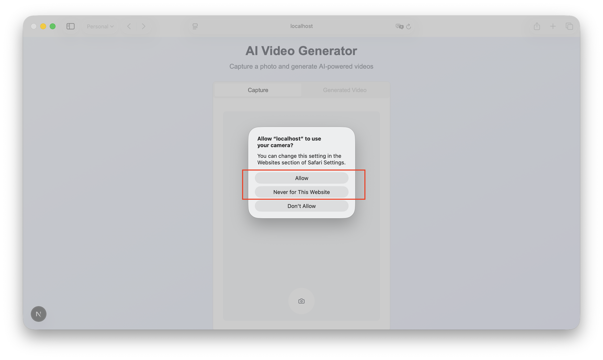
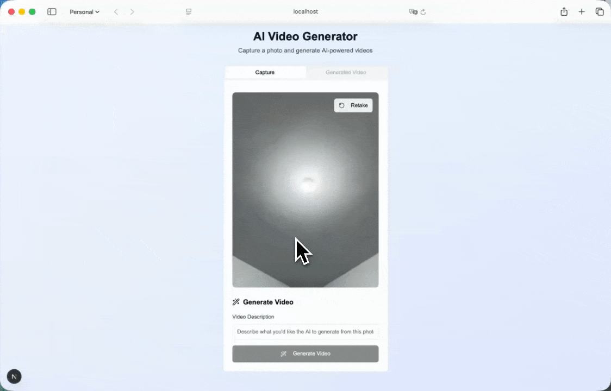

# Generate Fun Video From Camera Shoot using Kling AI


## Table of Contents

- [Prerequisites](#prerequisites)
  - [Node.js](#nodejs)
  - [GridDB](#griddb)
  - [Fal Kling 2.1 API](#fal-kling-21-api)
- [How to Run](#how-to-run)
  - [1. Clone the repository](#1-clone-the-repository)
  - [2. Install dependencies](#2-install-dependencies)
  - [3. Set up environment variables](#3-set-up-environment-variables)
  - [4. Run the project](#4-run-the-project)
  - [5. Open the application](#5-open-the-application)
- [Architecture](#architecture)
- [Technical Overview](#technical-overview)
  - [Camera Captures](#camera-captures)
  - [Image Prompt](#image-prompt)
  - [Generate Video](#generate-video)
  - [Kling 2.1 from Fal](#kling-21-from-fal)
    - [1. Initiating polling.](#1-initiating-polling)
    - [2. Checking the job status.](#2-checking-the-job-status)
    - [3. Call the API endpoint for a status check.](#3-call-the-api-endpoint-for-a-status-check)
    - [4. Handling video when the status is complete.](#4-handling-video-when-the-status-is-complete)
- [Saving Data to GridDB](#saving-data-to-griddb)
- [API Routes](#api-routes)
- [Read Data from GridDB](#read-data-from-griddb)
- [User Interface](#user-interface)

## What This Blog is About

Capturing a beautiful moment or any object in real life that you like from a camera and using AI to transform it into fun, stylized clips is a great way to engage users and showcase creative technology. 

In this guide, we build a developer-friendly pipeline using Next.js for the frontend, Fal.ai as a serverless inference runtime, Kling AI for video generation, and GridDB Cloud for real-time metadata storage. We’ll walk through how to capture frames from the webcam, send them to Kling for enhancement, log metadata (image URL, applied effects, which is the prompt, and generated video URL) to GridDB, and render the final video.


## Prerequisites

### Node.js

This project is built using Next.js, which requires Node.js version 16 or higher. You can download and install Node.js from [https://nodejs.org/en](https://nodejs.org/en).

### GridDB

#### Sign Up for GridDB Cloud Free Plan

If you would like to sign up for a GridDB Cloud Free instance, you can do so at the following link: [https://form.ict-toshiba.jp/download_form_griddb_cloud_freeplan_e](https://form.ict-toshiba.jp/download_form_griddb_cloud_freeplan_e).

After successfully signing up, you will receive a free instance along with the necessary details to access the GridDB Cloud Management GUI, including the **GridDB Cloud Portal URL**, **Contract ID**, **Login**, and **Password**.

#### GridDB WebAPI URL

Go to the GridDB Cloud Portal and copy the WebAPI URL from the **Clusters** section. It should look like this:


#### GridDB Username and Password

Go to the **GridDB Users** section of the GridDB Cloud portal and create or copy the username for `GRIDDB_USERNAME`. The password is set when the user is created for the first time. Use this as the `GRIDDB_PASSWORD`.


For more details, to get started with GridDB Cloud, please follow this [quick start guide](https://griddb.net/en/blog/griddb-cloud-quick-start-guide/).

#### IP Whitelist

When running this project, please ensure that the IP address where the project is running is whitelisted. Failure to do so will result in a 403 status code or forbidden access.

You can use a website like [What Is My IP Address](https://whatismyipaddress.com/) to find your public IP address.

To whitelist the IP, go to the GridDB Cloud Admin and navigate to the **Network Access** menu.


### Fal Kling 2.1 API

You need a Kling 2.1 API key to use this project. You can sign up for an account at [fal.ai](https://fal.ai).

After signing up, go to the **Account** section, and create and copy your API key.


Kling 2.1 is the latest version of Kling AI’s text/image-to-video generation engine, released in May 2025 by Kuaishou (also known as Kwai). It's a significant upgrade from Kling 1.6 and 2.0, bringing smoother motion, sharper visuals, stronger prompt adherence, faster speeds, and better cost efficiency.


## How to Run

### 1. Clone the repository

Clone the repository from [https://github.com/junwatu/camtovid-ai](https://github.com/junwatu/camtovid-ai) to your local machine.

```sh
git clone https://github.com/junwatu/camtovid-ai
cd camtovid-ai
cd apps
```

### 2. Install dependencies

Install all project dependencies using npm.

```sh
npm install
```

### 3. Set up environment variables

Copy file `.env.example` to `.env` and fill in the values:

```ini
# Copy this file to .env.local and add your actual API keys
# Never commit .env.local to version control

# Fal.ai API Key for Kling 2.1
# Get your key from: https://fal.ai/dashboard
FAL_KEY=


GRIDDB_WEBAPI_URL=
GRIDDB_PASSWORD=
GRIDDB_USERNAME=
```

Please look at the section on [Prerequisites](#prerequisites) before running the project.

### 4. Run the project

Run the project using the following command:

```sh
npm run dev
```

### 5. Open the application

Open the application in your browser at [http://localhost:3000](http://localhost:3000). You also need to allow the browser to access your camera. If you access the web application from a mobile device, there will be an option to select between the rear and back camera.



## Architecture


The architecture and user flow are intentionally simple for rapid development and ease of use. Users access the app from any desktop or mobile browser. After capturing an image with their device’s camera, they enter a prompt describing the video they want to generate.

The Next.js frontend sends both the image and prompt to Fal AI’s Kling 2.1 model. Kling 2.1 processes these inputs, generates a video, and returns it directly to the browser client.

When generation is done, the metadata: image URL, prompt, and generated video URL will be saved to the GridDB Cloud.


## Technical Overview

### Camera Captures

The `use-camera.ts` is a `useCamera` custom hook, which encapsulates all the logic for controlling the camera, including starting, stopping, switching, and capturing a photo. The `capturePhoto` function is the one that actually captures the image from the video stream and returns it as a base64-encoded JPEG.

```ts
// ... existing code ...
  const capturePhoto = useCallback(() => {
    if (videoRef.current && canvasRef.current) {
      const canvas = canvasRef.current
      const video = videoRef.current
      const context = canvas.getContext('2d')

      canvas.width = video.videoWidth
      canvas.height = video.videoHeight

      if (context) {
        context.drawImage(video, 0, 0)
        const imageData = canvas.toDataURL('image/jpeg')
        stopCamera()
        optionsRef.current.onSuccess?.('Photo captured successfully')
        return imageData
 }
 }
    optionsRef.current.onError?.('Failed to capture photo')
    return null
 }, [stopCamera])
// ... existing code ...
```

The `app/page.tsx` is the main page component. It uses the `useCamera` hook to get the `capturePhoto` function and other camera-related state and methods. The `handleCapturePhoto` function is called when the user clicks the capture button. This function calls `capturePhoto` from the hook and then updates the application state with the captured image data.

```ts
// ... existing code ...
  // Handle photo capture
  const handleCapturePhoto = () => {
    const imageData = capturePhoto()
    if (imageData) {
      setCapturedImage(imageData)
      setState('captured')
 }
 }
// ... existing code ...
```

### Image Prompt

In the `app/page.tsx`, there is a prompt input that only shows after a photo has been captured `(state === 'captured')`.

```ts
// ... existing code ...
 {/* Prompt Input Section - Only show after photo is captured */}
 {(state === "captured" || state === "generating" || state === "completed") && (
 <div>
 <div className="space-y-2">
 <Label htmlFor="prompt" className="text-lg font-semibold">
                        2. Enter Your Creative Prompt
 </Label>
 <Textarea
                        id="prompt"
                        placeholder="e.g., a majestic lion roaring on a cliff, cinematic lighting"
                        value={prompt}
                        onChange={(e) => setPrompt(e.target.value)}
                        className="min-h-[80px] text-base"
                        disabled={state === "generating"}
 />
 </div>
 </div>
 )}
 </TabsContent>

 <TabsContent value="video" className="p-6">
 <div className="space-y-6">
 {/* Video and Generation status */}
// ... existing code ...
```

Along with the `capturedImage`, this `prompt` will be used to generate video. This will happen if the user clicks the `Generate Video` button.

### Generate Video

Kling 2.1 API from the Fal needs two main parameters:

1. **Image reference**, which is the image the user captured from the camera
2. **Prompt** for the video creation.

Before the video generation, the captured image needed to be saved first. In this app, we use Fal server to save the captured image.

```ts
    // ... existing code ...
      static async uploadImage(imageData: string): Promise<ImageUploadResponse> {
 try {
          // Convert data URL to blob
          const response = await fetch(imageData);
          const blob = await response.blob();
          
          // Create form data
          const formData = new FormData();
          formData.append('file', blob, 'captured-image.jpg');
    
          const uploadResponse = await fetch(`${this.baseUrl}/upload-image`, {
            method: 'POST',
            body: formData,
 });
    // ... existing code ...
```

The upload process is handled by the `/api/upload-image` endpoint. This route uses the Fal.ai client `(@fal-ai/client)` to upload it to Fal.ai's storage. It then returns the public URL of the uploaded image.

```ts 
    // ... existing code ...
    import { fal } from '@fal-ai/client';
    // ... existing code ...
        // Upload file to Fal.ai storage
        const uploadUrl = await fal.storage.upload(file);
    
        return NextResponse.json({
          success: true,
          url: uploadUrl,
          file_name: file.name
 });
    // ... existing code ...
```

After successfully uploading an image and we get the image URL, the `useVideoGeneration` hook will call `VideoSeevice.generateVideo`, passing the image URL and the user's `prompt`:

```ts
    // ... existing code ...
          setUploadedImageUrl(uploadResult.url)
    
          // Start video generation
          setState('generating')
          setGenerationStatus('initializing')
          
          const result = await VideoService.generateVideo({
            image_url: uploadResult.url,
            prompt: prompt,
 })
    // ... existing code ...
```

The `generateVideo` will call the `/api/generate-video` endpoint, which in turn calls the Fal.ai Kling AI model to start the video generation job.

### Kling 2.1 from Fal

The AI model we use to generate video is [Kling 2.1](https://fal.ai/models/fal-ai/kling-video/v2.1/pro/image-to-video). Like other models on Fal, it is best accessed asynchronously. After the video generation job is submitted to Fal.ai, the application enters a monitoring phase to wait for the video to be ready. This is handled by polling for the result in an asynchronous process.

Here, step by step, is implemented in this app until the video is ready:

#### 1. Initiating polling.

 The `useVideoGeneration` hook in `hooks/use-video-generation.ts` doesn't just fire and forget. After submitting the job and getting a `request_id`, it starts a polling mechanism to repeatedly check the status of the generation job.

 ```ts
        // ... existing code ...
      if (result.success && result.request_id) {
        const imageUrl = uploadResult.url
        
        // Polling function
        const poll = async () => {
          try {
            const videoResult = await VideoService.getVideoResult(result.request_id!)
            const status = (videoResult as any).status
            
            setGenerationStatus(status)
            options.onStatusChange?.(status)

            if (status === 'COMPLETED') {
            // ... existing code ...
     } else if (status === 'FAILED' || status === 'CANCELLED') {
            // ... existing code ...
     } else {
              // Continue polling
              setTimeout(poll, pollInterval)
     }
     } catch (error) {
          // ... existing code ...
     }
     }
        
        poll()
     }
    // ... existing code ...
 ```

#### 2. Checking the job status.

 The poll function calls `VideoService.getVideoResult`, which is responsible for fetching the latest status of the video generation job.

 ```ts
        // ... existing code ...
      /**
     * Get the result of a video generation task
     */
      static async getVideoResult(requestId: string): Promise<VideoResultResponse> {
     try {
          const response = await fetch(`${this.baseUrl}/get-video?request_id=${requestId}`);
          const result = await response.json();
    
          if (!response.ok) {
            throw new Error(result.error || 'Failed to get video result');
     }
    
          return result;
     } catch (error) {
     return {
            success: false,
            error: 'Failed to process request',
            details: error instanceof Error ? error.message : 'Unknown error'
     };
     }
     }
    // ... existing code ...
 ```

#### 3. Call the API endpoint for a status check.

 The `VideoService` calls the `/api/get-video` endpoint. This endpoint uses the `fal-ai` client library to get the status of the job from Fal.ai using the `request_id`.

 ```ts
         // ... existing code ...
    export async function GET(request: NextRequest) {
      try {
        const { searchParams } = new URL(request.url)
        const requestId = searchParams.get('request_id')
    
        if (!requestId) {
          return NextResponse.json(
     { error: 'Missing request_id parameter' },
     { status: 400 }
     );
     }
    
        const result = await fal.queue.get(requestId);
    
        return NextResponse.json(result);
    
     } catch (error) {
        return NextResponse.json(
    // ... existing code ...
 ```
    
#### 4. Handling video when the status is complete.

 Once the polling mechanism receives a `COMPLETED` status, the `useVideoGeneration` hook updates the application state with the generated video's URL and calls the `onSuccess` callback that was passed to it from the main page component.

 ```ts
        // ... existing code ...
            if (status === 'COMPLETED') {
              const generatedVideoUrl = (videoResult as any).data.data.video.url
              setGeneratedVideo(generatedVideoUrl)
              setState('completed')
              setIsLoading(false)
              setGenerationStatus(null)
              
              options.onSuccess?.(generatedVideoUrl, imageUrl, prompt)
              
     }
    // ... existing code ...
 ```

 Once the video generation is complete, the video will be displayed in the **Generated Video** UI tab. More on this in the [User Interface](#user-interface) section.

## Saving Data to GridDB

After the video generation is completed, the app will save the metadata to GridDB Cloud. This saves the metadata of the generated video (the original image URL from Fal.ai, the user's prompt, and the new video URL) to your GridDB database.

So, here is the data schema used in the database that you can find in the `lib/types/griddb.types.ts` file:

```ts
// Types for container data
export interface GridDBData {
    id: string | number;
    imageURL: string;
    prompt: string;
    generatedVideoURL: string;
}
```

The sava data happening in the `app\page.tsx` main component:

```ts
    // ... existing code ...
      // Video generation management
      const {
    // ... existing code ...
 } = useVideoGeneration({
        onSuccess: async (videoUrl, imageUrl, promptText) => {
          setState('completed')
          setActiveTab('video')
          
    // ... existing code ...
    
          // Auto-save data
          const saved = await saveData({
            imageURL: imageUrl,
            prompt: promptText,
            generatedVideoURL: videoUrl,
 })
    // ... existing code ...
```

This `saveData` function calls the `/api/save-data` endpoint to perform the database operation.

## API Routes

This web app exposed some API.  Here is a table summarizing all the API routes used in this web application, along with their HTTP methods and descriptions.

| Route                  | HTTP Method | Description                                                                                             |
| ---------------------- | ----------- | ------------------------------------------------------------------------------------------------------- |
| `/api/upload-image` | `POST` | Receives an image file from the client and uploads it to Fal.ai's temporary storage, returning a URL.   |
| `/api/generate-video` | `POST` | Submits a job to the Fal.ai Kling AI model to generate a video using an image URL and a text prompt.      |
| `/api/get-video` | `GET` | Polls the Fal.ai service to check the status of a video generation job using its `request_id`.            |
| `/api/save-data` | `POST` | Saves the metadata for a generated video (image URL, prompt, video URL) into the GridDB database.         |

## Read Data from GridDB

The `GET` method in the `/api/save-data/route.ts` file is responsible for fetching all records from the database. 

Here's how it works:

```ts
// ... existing code ...
// Optional: Add GET method to retrieve data
export async function GET(request: NextRequest) {
  try {
    const { searchParams } = new URL(request.url);
    const id = searchParams.get('id');
    const limit = searchParams.get('limit') || '10';
// ... existing code ...
    let query;
    if (id) {
      // Search for specific ID
      query = {
        type: 'sql-select',
        stmt: `SELECT * FROM camvidai WHERE id = ${parseInt(id)}`
 };
 } else {
      // Get recent entries
      query = {
        type: 'sql-select',
        stmt: `SELECT * FROM camvidai ORDER BY id DESC LIMIT ${parseInt(limit)}`
 };
 }

    const result = await dbClient.searchData([query]);
// ... existing code ...
```

This `GET` function handles two cases:

1.  **Fetch by ID:** If an `id` is provided as a query parameter (e.g., `/api/save-data?id=123`), it fetches that specific record.
2.  **Fetch All (Recent):** If no `id` is provided, it fetches the most recent entries from the `camvidai` container, ordering them by ID in descending order. It defaults to a `limit` of 10 records, but this can be changed with a query parameter (e.g., `/api/save-data?limit=50`).

So, to get all the data (or at least the most recent set), you would make a `GET` request to `/api/save-data`.


## User Interface

The user interface is built using Next.js. It has three main views:

1. Capture Tab.
2. Prompt Input (shows only after image captured).
3. Generated Video Tab.

In essence, the UI is a wizard-like workflow that moves the user through a linear sequence: `Capture` -> `Prompt` -> `Generate` -> `View Video`.

The best way to get to know the user interface is to try it yourself! ☺️ However, here is a demo so you can see what the app looks like.




